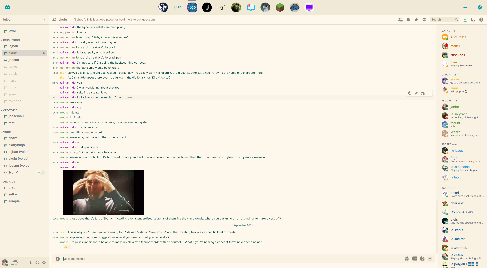
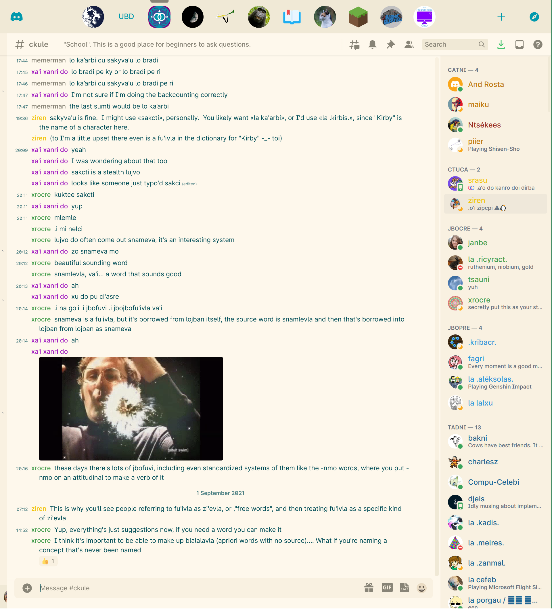

# Discord Theme

This is a Discord CSS injection stylesheet for my personal Discord theme. It's similar to Gruvbox Light or Solarized Light, and is based on the Noctis Lux VS Code theme.



In a more narrow view the sidebar collapses:



## Building and Using

```bash
make
# the compiled theme is now at dist/theme.css
```

## Known Issues

Due to being hard-coded with a ton of JS animations, server folders kind of just don't work.
